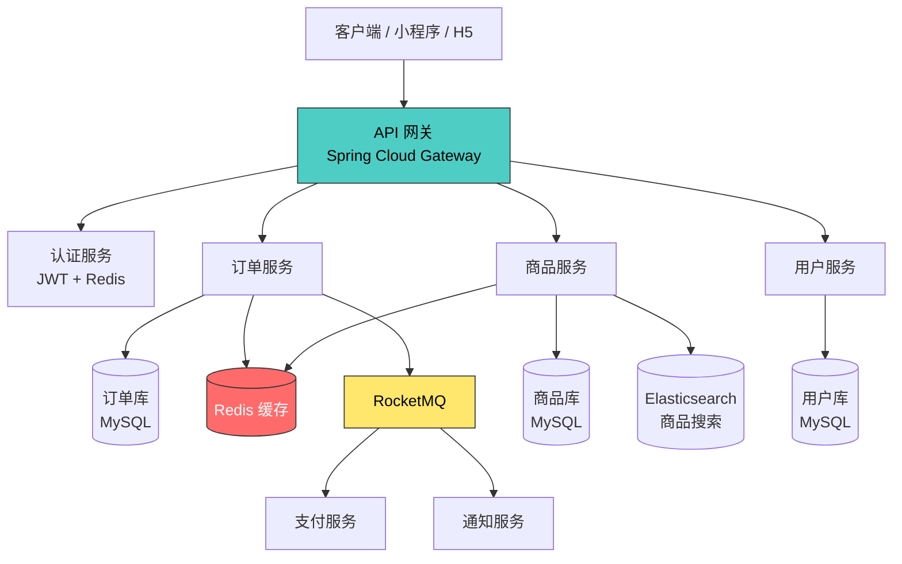
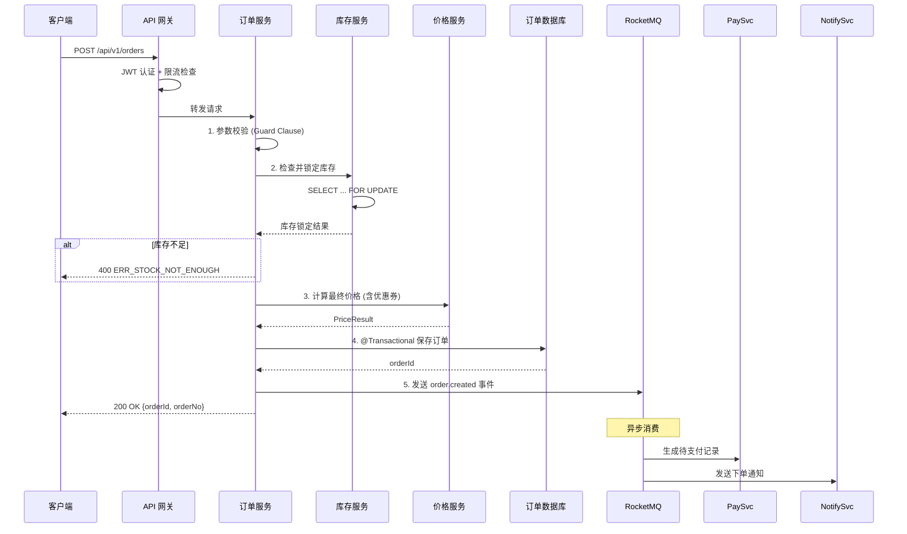
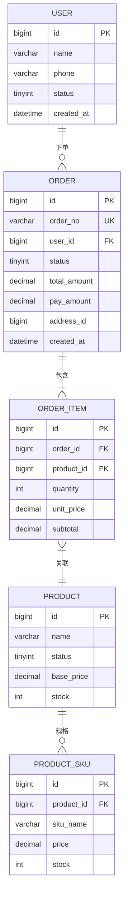
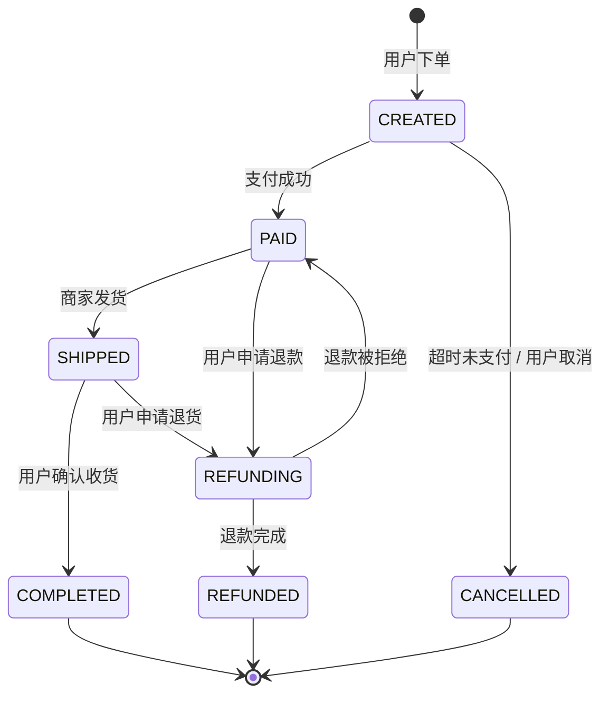
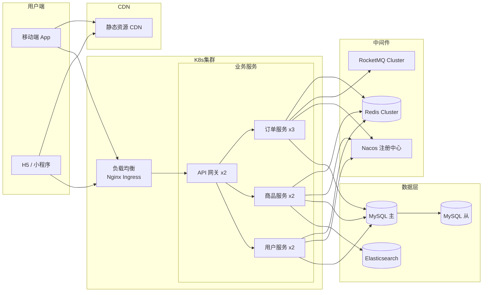

# 少样本示例：Mermaid 图表
# 用途: 作为 LLM 生成架构图表的参考范本, 展示各类 Mermaid 图表的标准写法

---

## 示例 1: 系统组件图（分层架构）

---

## 示例 2: 核心业务时序图（订单创建）

---

## 示例 3: ER 图（核心实体关系）

---

## 示例 4: 状态机流程图（订单状态流转）

---

## 示例 5: 部署架构图

