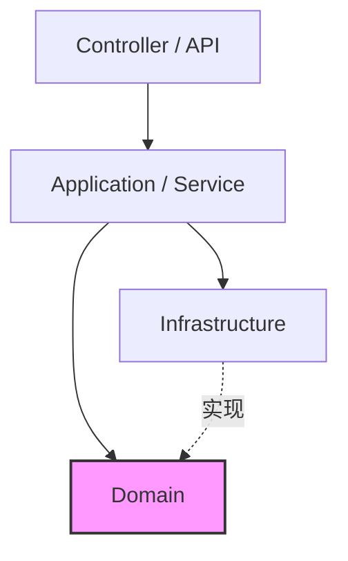
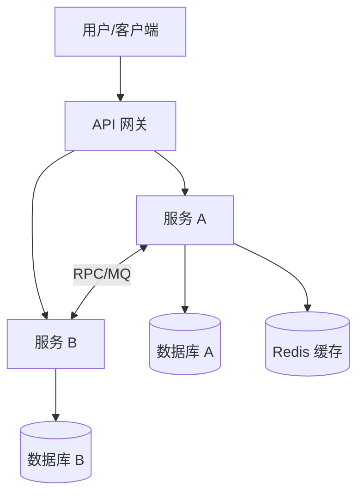
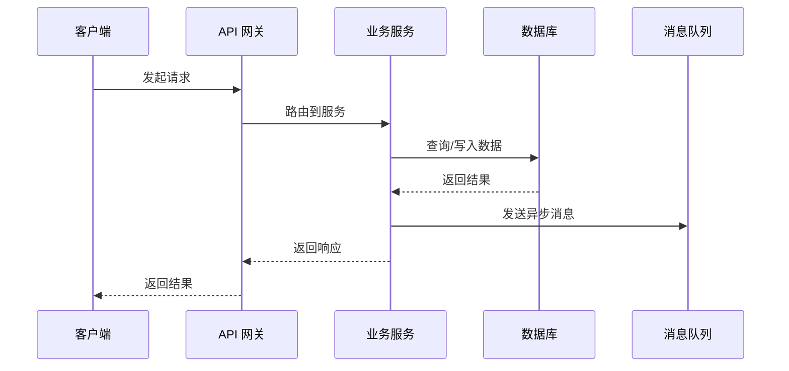
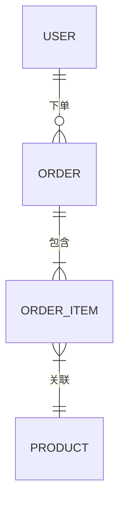

# 系统架构设计文档

> **本模板是架构文档的最低标准。** AI 生成的架构设计必须覆盖以下所有章节，
> 任何章节缺失都将被 `bmad-document-reviewer` 和 Gatekeeper 拒绝通过。

---

## 1. 系统概述

- **项目名称：** {project_name}
- **目标：** [简述系统解决的核心问题，1-2 句话]
- **核心领域：** [列出核心业务领域，如：订单、支付、库存]
- **用户角色：** [列出主要用户角色及其职责]

---

## 2. 技术栈选型

> **每项选型必须有理由。** 禁止只列技术名称而不解释"为什么选它"。

| 类别 | 技术/工具 | 版本 | 选型理由 |
| :--- | :--- | :--- | :--- |
| 语言 | Java | 17+ | [具体理由，如：团队熟悉度、生态成熟度] |
| 框架 | Spring Boot | 3.x | [理由] |
| 数据库 | MySQL / PostgreSQL | 8.x / 15.x | [理由，如：ACID、JSON 查询需求] |
| 缓存 | Redis | 7.x | [理由] |
| 消息队列 | RocketMQ / Kafka | - | [理由] |
| 注册中心 | Nacos | 2.x | [理由] |

---

## 3. 架构决策记录 (ADR)

> **格式：背景 → 可选方案 → 决策 → 后果。**
> 每个重要技术决策必须记录在案，便于后续追溯和新成员理解。

### ADR-001: 数据库选型

- **背景：** [描述需要做决策的上下文]
- **可选方案：**
  1. MySQL — [优劣分析]
  2. PostgreSQL — [优劣分析]
  3. MongoDB — [优劣分析]
- **决策：** 选用 [X]
- **理由：** [具体决策依据]
- **后果：** [选择后带来的影响和约束]

### ADR-002: [下一个决策主题]

- **背景：** ...
- **可选方案：** ...
- **决策：** ...
- **理由：** ...
- **后果：** ...

---

## 4. 系统分层与依赖规则

> **模块边界明确，禁止反向依赖。**

### 分层架构

| 层级 | 职责 | 允许依赖 | 严禁依赖 |
| :--- | :--- | :--- | :--- |
| `api` / `controller` | 对外接口、参数校验、路由 | application | domain, infrastructure 的实现 |
| `application` / `service` | 业务编排、事务控制 | domain, infrastructure 接口 | controller |
| `domain` | 核心领域模型、业务规则 | 无外部依赖 | infrastructure, application |
| `infrastructure` | 基础设施实现（DB、MQ、外部接口） | domain 接口 | application, controller |

### 依赖方向图

> **强制规则：** `domain` 层绝不依赖 `infrastructure` 层的具体实现。
> 如需调用基础设施，通过接口（在 domain 层定义）+ 实现（在 infrastructure 层）。

---

## 5. 核心组件图

> **必须使用 Mermaid 语法。** 禁止纯文字描述复杂架构关系。

---

## 6. 核心业务时序图

> **至少提供一个核心业务流程的时序图。**

---

## 7. 数据库设计概要

> **核心实体的表结构概要，至少列出主要字段、类型和索引。**

### 核心实体关系

### 主要表结构

| 表名 | 核心字段 | 索引 | 说明 |
| :--- | :--- | :--- | :--- |
| `t_user` | id, name, phone, status | idx_phone(UNIQUE) | 用户表 |
| `t_order` | id, user_id, status, total_amount, created_at | idx_user_id, idx_status | 订单表 |

---

## 8. 非功能性需求

> **必须包含安全性、性能、可扩展性、容错性的设计说明。**

### 8.1 安全性

- **认证方式：** [JWT / OAuth2 / Session]
- **鉴权模型：** [RBAC / ABAC]
- **数据加密：** [传输层 HTTPS、存储层敏感字段加密]
- **SQL 注入防护：** [ORM 参数绑定，禁止字符串拼接 SQL]
- **敏感数据脱敏：** [日志中手机号、身份证号的脱敏规则]

### 8.2 性能

- **响应时间目标：** [核心接口 P99 < Xms]
- **并发量目标：** [峰值 QPS]
- **缓存策略：** [热点数据缓存方案]
- **数据库优化：** [读写分离 / 分库分表策略]

### 8.3 可扩展性

- **水平扩展：** [无状态服务设计，支持多实例部署]
- **插件化设计：** [策略模式 + SPI 扩展点]
- **配置外部化：** [Nacos / Apollo 配置中心]

### 8.4 容错性

- **熔断降级：** [Sentinel / Resilience4j]
- **重试策略：** [指数退避 + 最大重试次数]
- **幂等设计：** [写接口的幂等 token 或唯一约束]
- **数据一致性：** [最终一致性 / 分布式事务方案]

---

## 9. 部署架构

> **描述部署拓扑和环境划分。**

| 环境 | 用途 | 基础设施 |
| :--- | :--- | :--- |
| dev | 开发联调 | [本地 / Docker Compose] |
| test | 集成测试 | [K8s / ECS] |
| staging | 预发布验证 | [与生产同构] |
| prod | 生产环境 | [K8s 集群 / 云服务] |

---

## 审查要点（Document Reviewer 检查项）

以下是本文档通过审查的**最低要求**：

- [ ] 包含至少一个 Mermaid 图表（组件图或时序图）
- [ ] 每项技术选型有明确理由
- [ ] 包含至少一条架构决策记录 (ADR)
- [ ] 定义了模块依赖方向和禁止反向依赖规则
- [ ] 包含非功能性需求（安全、性能、可扩展性、容错性）
- [ ] 数据库设计至少列出核心实体和主要字段
