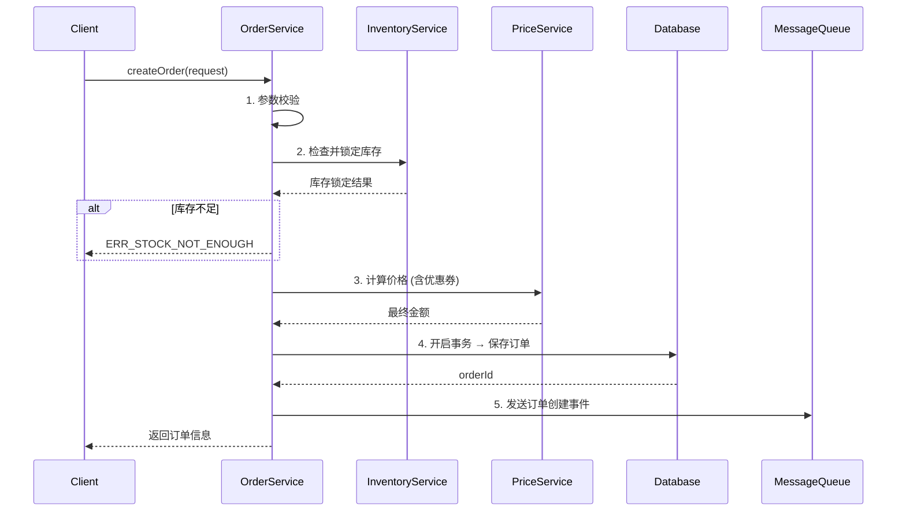

# 技术规格说明书: {功能名称}

> **本模板是技术实现文档的最低标准。** 是代码生成的"直接施工图纸"，
> 必须精确到接口字段、数据库 DDL 和逻辑分支。
> 任何章节缺失都将被 `bmad-document-reviewer` 和 Gatekeeper 拒绝通过。

---

## 1. 功能概述

- **功能名称：** {feature_name}
- **所属模块：** {module_name}
- **关联 Story：** {story_key}
- **优先级：** P0 / P1 / P2
- **预计复杂度：** 高 / 中 / 低

### 业务背景

[简述本功能要解决的业务问题和期望效果，2-3 句话]

---

## 2. 接口定义

> **每个接口必须包含完整的 URL、Method、Request/Response JSON 示例。**
> 禁止只写"接收订单数据"这样的模糊描述。

### 2.1 创建订单

- **URL：** `POST /api/v1/orders`
- **Content-Type：** `application/json`
- **认证：** Bearer Token (必须)

**Request Body：**
```json
{
  "userId": "string, required — 用户ID",
  "items": [
    {
      "productId": "string, required — 商品ID",
      "quantity": "integer, required — 数量, min=1",
      "skuId": "string, optional — SKU ID"
    }
  ],
  "addressId": "string, required — 收货地址ID",
  "couponId": "string, optional — 优惠券ID",
  "remark": "string, optional — 订单备注, maxLength=200"
}
```

**Response (200 OK)：**
```json
{
  "code": 200,
  "message": "success",
  "data": {
    "orderId": "string — 订单ID",
    "orderNo": "string — 订单编号",
    "totalAmount": "decimal — 订单总金额",
    "status": "string — 订单状态 (CREATED)",
    "createdAt": "datetime — 创建时间"
  }
}
```

**Error Responses：**
```json
{ "code": 40001, "message": "商品库存不足", "data": null }
{ "code": 40002, "message": "优惠券不可用", "data": null }
{ "code": 40003, "message": "收货地址不存在", "data": null }
```

### 2.2 [下一个接口...]

- **URL：** `GET /api/v1/orders/{orderId}`
- ...

---

## 3. 数据库变更

> **必须提供具体的字段定义（类型、长度、默认值、索引）。**
> 推荐直接给出 SQL DDL，或至少用表格明确每个字段。

### 3.1 新建表

```sql
CREATE TABLE `t_order` (
    `id`            BIGINT          NOT NULL AUTO_INCREMENT COMMENT '主键',
    `order_no`      VARCHAR(32)     NOT NULL                COMMENT '订单编号',
    `user_id`       BIGINT          NOT NULL                COMMENT '用户ID',
    `status`        TINYINT         NOT NULL DEFAULT 0      COMMENT '状态: 0-待支付, 1-已支付, 2-已发货, 3-已完成, 4-已取消',
    `total_amount`  DECIMAL(10,2)   NOT NULL DEFAULT 0.00   COMMENT '订单总金额',
    `pay_amount`    DECIMAL(10,2)   NOT NULL DEFAULT 0.00   COMMENT '实付金额',
    `address_id`    BIGINT          NOT NULL                COMMENT '收货地址ID',
    `remark`        VARCHAR(200)    DEFAULT NULL             COMMENT '订单备注',
    `created_at`    DATETIME        NOT NULL DEFAULT CURRENT_TIMESTAMP COMMENT '创建时间',
    `updated_at`    DATETIME        NOT NULL DEFAULT CURRENT_TIMESTAMP ON UPDATE CURRENT_TIMESTAMP COMMENT '更新时间',
    `deleted`       TINYINT         NOT NULL DEFAULT 0      COMMENT '逻辑删除: 0-未删, 1-已删',
    PRIMARY KEY (`id`),
    UNIQUE KEY `uk_order_no` (`order_no`),
    KEY `idx_user_id` (`user_id`),
    KEY `idx_status` (`status`),
    KEY `idx_created_at` (`created_at`)
) ENGINE=InnoDB DEFAULT CHARSET=utf8mb4 COMMENT='订单主表';
```

### 3.2 修改表

| 表名 | 操作 | 字段名 | 类型 | 默认值 | 说明 |
| :--- | :--- | :--- | :--- | :--- | :--- |
| `t_order` | ADD COLUMN | `coupon_id` | BIGINT | NULL | 优惠券ID |

---

## 4. 核心逻辑流程

> **复杂业务逻辑必须提供流程图或伪代码。**
> 禁止只写"实现订单创建逻辑"这样的一句话描述。

### 4.1 流程图



### 4.2 伪代码

```
function createOrder(request):
    // 1. 参数校验
    validate(request)  // 非空、格式、权限

    // 2. 库存检查与锁定
    for item in request.items:
        stock = inventoryService.checkAndLock(item.productId, item.quantity)
        if stock.insufficient:
            throw BizException(ERR_STOCK_NOT_ENOUGH, item.productId)

    // 3. 价格计算
    priceResult = priceService.calculate(request.items, request.couponId)
    if priceResult.couponInvalid:
        throw BizException(ERR_COUPON_INVALID)

    // 4. 事务落库
    @Transactional:
        order = buildOrder(request, priceResult)
        orderMapper.insert(order)
        orderItemMapper.batchInsert(order.items)
        if request.couponId:
            couponService.markUsed(request.couponId, order.id)

    // 5. 异步通知
    messageQueue.send("order.created", order.id)

    return OrderConverter.toVO(order)
```

---

## 5. 异常与错误码

> **必须列出本功能可能抛出的所有业务异常及其错误码。**

| 错误码 | HTTP 状态 | 错误常量 | 触发条件 | 处理建议 |
| :--- | :--- | :--- | :--- | :--- |
| 40001 | 400 | ERR_STOCK_NOT_ENOUGH | 商品库存不足 | 提示用户减少数量或选择其他商品 |
| 40002 | 400 | ERR_COUPON_INVALID | 优惠券不可用（过期/已使用/不满足条件） | 提示用户移除优惠券 |
| 40003 | 400 | ERR_ADDRESS_NOT_FOUND | 收货地址不存在或已删除 | 提示用户选择其他地址 |
| 40004 | 400 | ERR_PRICE_CALC_FAIL | 价格计算异常 | 系统内部错误，记录日志并告警 |
| 50001 | 500 | ERR_ORDER_CREATE_FAIL | 订单创建数据库异常 | 重试或人工介入 |

---

## 6. 依赖与影响范围

### 上游依赖

| 服务/模块 | 接口 | 说明 |
| :--- | :--- | :--- |
| InventoryService | `checkAndLock(productId, qty)` | 库存检查与锁定 |
| PriceService | `calculate(items, couponId)` | 价格计算（含优惠） |
| CouponService | `markUsed(couponId, orderId)` | 标记优惠券已使用 |

### 下游影响

| 消费方 | 事件/接口 | 说明 |
| :--- | :--- | :--- |
| PaymentService | `order.created` (MQ) | 生成待支付记录 |
| NotificationService | `order.created` (MQ) | 发送下单通知 |

---

## 7. 测试要点

| 测试类型 | 场景 | 预期结果 |
| :--- | :--- | :--- |
| 正常流程 | 有效参数创建订单 | 返回订单信息，状态=CREATED |
| 库存不足 | 商品库存为 0 | 返回 40001 错误 |
| 无效优惠券 | 使用过期优惠券 | 返回 40002 错误 |
| 并发测试 | 同一商品同时下单 | 库存不超卖 |
| 幂等测试 | 重复请求 | 只创建一笔订单 |

---

## 审查要点（Document Reviewer 检查项）

以下是本文档通过审查的**最低要求**：

- [ ] 接口定义包含完整的 JSON Request/Response 示例
- [ ] 数据库字段包含类型、长度、默认值（推荐 DDL）
- [ ] 核心逻辑有流程图（Mermaid）或伪代码
- [ ] 列出了所有可能的业务异常和错误码
- [ ] 描述了上下游依赖关系
